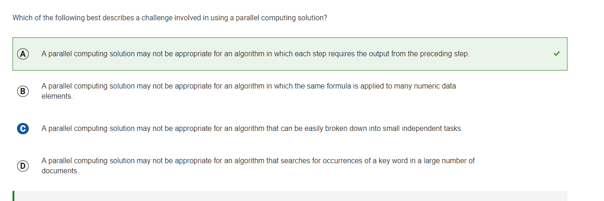

## Q3: What are the values of first and second as a result of executing the code segment?

I picked: D

Correct Answer: A

I picked D because I did not know how collegeboard notation worked as I'm only involved with equal signs. By this I knew second was 100, but then I mistakened first to be 200 because of the way it said first <- second. I should've known that second was already 100 and that first would be also be 100 this way. 

## Q4: Which of the following best explains the relationship between the Internet and the World Wide Web?

I picked: C
Correct Answer: D

I picked C knowing that the internet is a bunch of interconnected devices, so I was able to eliminate A and B. I knew that the Internet has files and links inside of it, however I picked C as it sounded more complex and and it "made more sense". D was correct as it correctly interprets that the WWB is full of links and files that is connected to the internet. 

## Q5: If a game is begun by placing the game piece on the rightmost black space for step 1, what will be the value of the counter at the end of the game?

I picked: B
Correct Answer: C

I calculated everything correctly until the green spaces. I did not read the question properly as I thought green also moved 2 to the left. I didn't increase the counter after that and I got stuck at 3. If I increased the counter properly I would've had 3+1 = 4 which is the correct answer. 

## Q12: Which of the following replacements for <MISSING CODE> can be used to move the robot to the gray square?

I picked: D
Correct Answer: C

I picked D as I misinterpreted to if it can rotate left, it rotates left, but in reality the code works that if there is a black square on the left, then it it moves forward otherwise it rotates left. Because of this misinterpretation, I picked D instead of C, as I already elminated A and B. 

## Q15: Which of the following code segments can be used to draw the figure?

I picked: C
Correct Answer: A

I picked C as I calculated it in my head and thought it works when going backwards. Turns out every Y-value segment is exactly five segments long which means that answer is incorrect. Since the y-value isn't changing, it would not be C and A would make the most sense since its iterating correctly. I didn't check that y-value changing so it meant that A would be correct. 

## Q16: Which of the following code segments can be used to draw the figure?

I picked: D
Correct Answer: B

This one I guess on, even though we went over this in class. I misinterpreted no-rights to mean "no one has rights" but in reality its quite the opposite of that. This is something I have to review on and study the past team teaches in order to remember this information. 

## Q19: Which of the following code segments can be used to draw the figure?

Which of the following best explains how devices and information can be susceptible to unauthorized access if weak passwords are used?

I picked: D
Correct Answer: C

This one again, I did not keep in mind and I have to relearn the team teaches to better prepare for the AP Exam. Data mining is related to extracting data username and passwords if they are insecure and I will keep that in mind later on for the next few AP Practice Exams. 

## Q20: A local router is configured to limit the bandwidth of guest users connecting to the Internet. Which of the following best explains the result of this configuration as compared to a configuration in which the router does not limit the bandwidth?

I picked: B
Correct Answer: D

Since bandwith deals with data, I eliminated A and C. It was D because if many users are to connect to the Internet, some large files cannot send over the network because bandwith limits the amount of data transfer. So D would be correct as users would have to send less data to make the Internet not crash. 

## Q23: Which of the following statements about the Internet is true?

I picked: C
Correct Answer: B

The internet was not designed to be completely secure, but to be scalable for every user created in order to better support every user. Open Protocols help scale the internet to many users created. 

## Q25: In the following procedure, the parameter n is an integer greater than 2.

I picked: A
Correct Answer: D

This one I completely guessed as I wanted to attempt as many questions as possible. This one iterates and increased the result my one and same with j, because of this, every result is increasing by 1 after repeating. 

## Q26: Which of the following best describes a challenge involved in using a parallel computing solution?

I picked: C
Correct Answer: A

In parallel computing, it is required that 